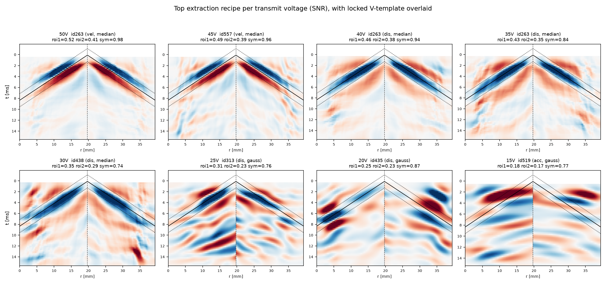
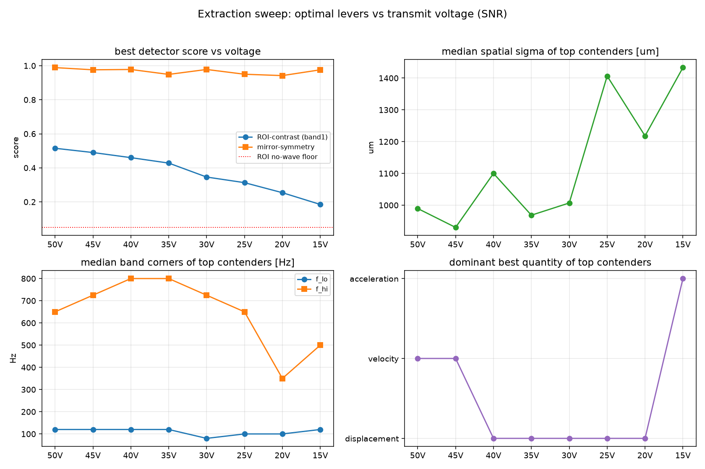

# Low-SNR shear-wave extraction sweep (phantom voltage series)

**Date:** 2026-08-04 acquisition, analysed 2026-08-06
**Data:** `2026_08_04 voltage sweep/Phantom/` — one calibrated CIRS phantom, ARF push at a fixed
location, imaged at 8 transmit voltages (50, 45, 40, 35, 30, 25, 20, 15 V), `meas0` each. Buffer-2
real RF (NS200BW), ~59 tracking frames @ 3704 Hz, displacement relative to the pre-push reference.
Voltage is the SNR knob: higher V → larger push → cleaner shear wave; the phantom is otherwise fixed.

## Question

Can we reliably **extract and detect** the shear-wave "V" in low-SNR (low-voltage) data, and **how do
the optimal processing settings shift with SNR**? Two constraints set earlier drove the design:

1. Do **not** rely on a fitted shear-wave speed (not robust at low SNR).
2. There is **no single recipe for all SNRs** — low-SNR data needs more (spatial *and* temporal)
   smoothing. So we detect *whether the symmetric V is present* rather than measure a speed, and we
   let every lever float and read off how the winners change with voltage.

## Method

### Detectors (no speed fit)

Both operate on the outward-directional space-time image; neither fits or reports a speed.

- **ROI-contrast** (`scripts/detect_v.py::roi_contrast`) — a **locked V-template** was drawn **once**
  on the clean 50 V velocity image (`scripts/draw_v_roi.py`, saved to `v_roi_template.json`:
  r0 = 19.7 mm, c = 2.39 m/s, t0 = 0.088 ms). For every column on both lobes it compares the mean
  envelope on the template band `t = t0 + |r−r0|/c ± band` to that column's whole-column mean
  (background). Contrast `(ROI−bg)/(ROI+bg) ∈ [−1,1]`; >0 means a wavefront rides the template.
  Empirical no-wave floor ≈ 0.05. Evaluated at **two bands**: **band1 = ±1.2 ms** (as drawn) and
  **band2 = ±2.4 ms** (2× wide, to gauge band-width sensitivity).
- **Mirror-symmetry** (`symmetric_v_score`) — Pearson correlation of the left-lobe vs right-lobe
  envelope images resampled onto a common distance-from-r0 grid. A symmetric wave → ~1; one-sided
  patterns / noise → ~0. Robust to smoothing.

The template's r0/c/t0 are physical, so the same template applies to every voltage (same phantom,
same push) and to the fine-grid images below.

### Sweep space (`scripts/sweep_extract.py`)

**Fixed winners** (settled in earlier rounds): Loupas estimator, `relative_to_reference` mode,
outward directional filter, mean M-line aggregation.

**Swept SNR levers** (700 random recipes, seed 0):

| Lever | Range |
|---|---|
| IQ clutter | none / SVD-1 / SVD-2 |
| Band-pass corners | f_lo ∈ {10,20,40,80,120} Hz, f_hi ∈ {350,500,650,800} Hz |
| Drift removal | ±polynomial (order 2–3), occasional field-SVD |
| Spatial smoothing | Gaussian σ (200–2500 µm ax / 400–4000 µm lat) / median size / NLM / none |
| Temporal smoothing | moving-mean / moving-median / Savitzky-Golay / none |
| M-line offsets | {1,3,5,7,9}, step 0.4–1.2 mm |

Each recipe is evaluated on **all 8 voltages × 3 quantities** (displacement / velocity / acceleration)
and scored by the three detector outputs (roi1, roi2, sym), keeping the best quantity per detector.
That is **700 × 8 × 3 = 16 800 pipeline evaluations**. The Loupas estimator is **cached** per
(voltage, IQ-config) and only the post-estimator field-filter → M-line → directional → detector steps
run per recipe; the cached path was verified to reproduce `core.run_recipe` exactly (0.3952 = 0.3952).
Total runtime ≈ **72 min**.

### RF-NCC probe (`scripts/sweep_rfncc_probe.py`)

A **limited** probe: 4 near-optimal field-filter recipes run with the fine-grid **RF-NCC** estimator
(re-beamformed fine axial grid) instead of coarse-IQ Loupas, on 50/30/25/20/15 V, same detectors —
"just to see what happens" before committing to a larger RF-NCC run.

## Results

Outputs in `2026_08_04 voltage sweep/metric_experiment/`:
`sweep_results.csv`, `sweep_leaderboards.txt`, `sweep_snr_trends.png`, `sweep_top_montage.png`,
`rfncc_probe.csv`.

### 1. The V is detectable at every voltage, degrading smoothly with SNR



`sweep_top_montage.png` (top recipe per voltage, V-template overlaid): a crisp symmetric V rides the
template at **50–35 V**, is still clearly present at **30–20 V** (weaker, needs heavier smoothing),
and is **marginal at 15 V**. The best ROI-contrast falls monotonically **0.52 → 0.19** but stays
**above the 0.05 no-wave floor at all 8 voltages**. Mirror-symmetry stays high (0.94–0.99) on the
*selected* contenders — it is a good **gate** (is there a symmetric V at all?) but saturates on the
top picks, so **ROI-contrast is the grader** of wavefront strength.

### 2. How the optimal levers shift with SNR (top-12 medians)

| V | best roi1 | spatial | σ (µm) | band (Hz) | quantity | offsets | IQ |
|----|------|--------|-----|---------|--------|----|------|
| 50 | 0.515 | median | ~990  | 120–650 | velocity | 7 | none |
| 45 | 0.490 | median | ~930  | 120–725 | velocity | 8 | none |
| 40 | 0.460 | median | ~1100 | 120–800 | displacement | 9 | none |
| 35 | 0.428 | median | ~970  | 120–800 | displacement | 9 | none |
| 30 | 0.346 | gauss  | ~1010 | 80–725  | displacement | 9 | none |
| 25 | 0.313 | gauss  | ~1410 | 100–650 | displacement | 7 | SVD-2 |
| 20 | 0.254 | gauss  | ~1220 | 100–350 | displacement | 7 | SVD-2 |
| 15 | 0.185 | gauss  | ~1430 | 120–500 | acceleration* | 7 | SVD-2 |



Trends (`sweep_snr_trends.png`):

- **Spatial smoothing grows and switches type as SNR drops:** median filtering wins at high SNR
  (≥35 V; edge-preserving, keeps the wavefront sharp), Gaussian with a **larger σ (~1000 → ~1400 µm)**
  wins at low SNR (≤30 V; more aggressive averaging beats the noise).
- **Usable bandwidth narrows toward low frequencies:** f_lo stays ~100–120 Hz, but the high corner
  collapses from **~800 Hz (high SNR) to ~350–500 Hz (low SNR)** — at low SNR the high-frequency band
  is noise, so keep only the low-frequency shear-wave energy.
- **Readable quantity shifts velocity → displacement:** velocity is sharpest at 50–45 V,
  displacement is most robust at 40–20 V. (\*The 15 V "acceleration" winner is marginal — both
  detectors are weak there and partly disagree; **displacement** with heavy smoothing is the safer
  read at 15 V.) This matches the earlier human-in-the-loop observation.
- **IQ clutter removal (SVD) starts to help at low SNR** (25 V and below), and low-SNR winners also
  tend to add polynomial-drift / field-SVD motion cleanup.
- **More M-line offset averaging** (7–9) is preferred throughout.

### 3. Two robust general-purpose recipes

Two recipes recur near the top across many voltages; **id438** is flagged `**` (top on *both*
detectors) at 45/40/35 V and is the best all-round choice:

- **id438 (robust, all SNR):** band-pass 80–500 Hz → spatial **median** 0.90 × 2.64 mm → temporal
  **moving-median w5** → 9 offsets @ 1.09 mm → outward. (Loupas, rel-ref.)
- **id263 (sharp, high SNR):** band-pass 120–800 Hz → spatial median 1.04 × 2.67 mm → moving-median
  w7 → 9 offsets @ 0.99 mm → outward.
- **Low-SNR add-ons (≤25 V):** switch to Gaussian σ ≈ 1.2–1.7 mm, drop f_hi to 350–500 Hz, add
  **SVD-2 IQ clutter** (+ polynomial-drift), read **displacement**. (e.g. 20 V winner id435,
  15 V winner id519.)

### 4. RF-NCC does not help — do not expand

RF-NCC **underperformed coarse Loupas at every voltage**, and the gap **widened as SNR dropped**:

| V | RF-NCC best roi1 | coarse-Loupas best roi1 |
|----|------|------|
| 50 | 0.447 | 0.515 |
| 30 | 0.320 | 0.346 |
| 25 | 0.175 | 0.313 |
| 20 | 0.062 | 0.254 |
| 15 | 0.072 | 0.185 |

Correlation-based (NCC) per-pixel displacement needs speckle SNR; at low voltage it is noisier than
phase-based Loupas on coarse IQ with heavy spatial averaging. **Conclusion: not worth a larger
RF-NCC run** for this extraction task.

## Takeaways

1. The ARF shear-wave V **is present and detectable down to 15 V** on this phantom — low SNR is a
   processing problem, not a missing-signal problem.
2. **There is no single recipe.** As SNR drops: more spatial smoothing (median→large-σ Gaussian),
   narrower low-frequency band, read displacement instead of velocity, and add SVD clutter removal.
3. **ROI-contrast on a locked template is the strength grader; mirror-symmetry is the presence
   gate.** Neither fits a speed, per the design constraints.
4. RF-NCC is not the answer for low SNR here.

## Reproduce

```bash
# from repo root, with the zea env + KERAS_BACKEND=torch
python scripts/draw_v_roi.py --voltage 50V --quantity velocity   # (once) locks v_roi_template.json
python scripts/sweep_extract.py --n 700 --seed 0                  # ~72 min -> sweep_results.csv
python scripts/sweep_analyze.py --k 12                            # leaderboards + sweep_snr_trends.png
python scripts/sweep_top_montage.py                               # sweep_top_montage.png
python scripts/sweep_rfncc_probe.py                               # rfncc_probe.csv
```

## Caveats

- One phantom, one push location, `meas0` only; voltage is a proxy for SNR. Absolute thresholds
  (roi ≈ 0.05 floor, σ/band numbers) are phantom-specific; the *trends* are the transferable result.
- The template geometry (c = 2.39 m/s) is this phantom's; re-draw for a different medium.
- Data paths in the scripts are absolute to `D:/Luuk van Knippenberg/Claude/...` (kept out of git).
