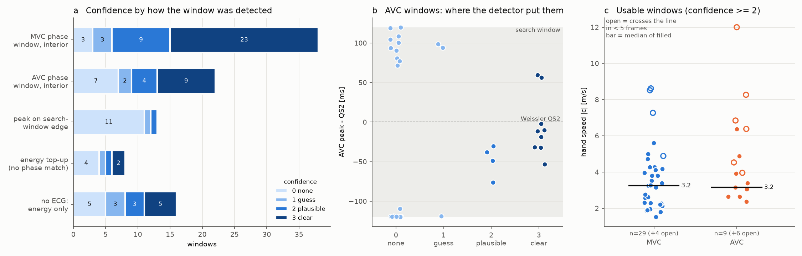

# Manual passive reading - preliminary evaluation (2026-09-29)

First look at the whole-study manual reading (`scripts/passive_manual.py`, [passive_manual.md](passive_manual.md))
after one session on unwrap version 2. It covers 27 acquisitions (C000000001-31): 125 M-lines,
104 detected windows and 97 scored slopes, all by one observer on 2026-09-29, 10:20-16:50.

- Tables: `study/logs/passive_manual_prelim/` (`prompts`, `lines`, `windows`, `windows_scored`).
- Collector: `study/analysis/passive_manual_prelim.py`.
- Figure: `study/analysis/passive_manual_prelim_figure.py`.



## 1. Are M-line prompts served more than once?

**No.**
- **Logs:** every (folder, task, window) has exactly one accept in the logs. No folder was
  re-detected or archived: the only archives are the 09-25 buffer-3 ones.
- **Why lines outnumber slopes:** the prompt structure. A folder asks for one general line plus
  one line per event, but only one slope per event (27 + 98 = 125 lines vs 97 slopes). Also, the
  session serves the next folder's general line while the workers detect and process, so lines
  run ahead of slopes.
- **Why prompts can look repeated:**
  - two MVC events of one acquisition sit at the same cardiac phase;
  - each shows the September line of that event;
  - in 5 of 139 event pairs they even get the identical buffer-1 and buffer-3 frame. Only
    buffer 4 differs, one beat apart.

## 2. Lines drawn on buffer 4 but initialised on buffer 1

- **Where the pre-loads came from.** All 90 pre-loaded lines came from the September set, which
  was drawn on buffer 1: 27 general lines and 63 event lines.
- **What happened when they were accepted.** The editor opened each line on buffer 1, so
  pressing ENTER saved the motion-corrected copy on buffer 4. That happened for 7 event lines,
  all in C000000027-30:

| line | shift on buffer 4 | registration |
|---|---|---|
| C27 w0 | 0.71 mm | trusted |
| C27 w1 | 0.12 mm | trusted |
| C27 w2 | 0.71 mm | trusted |
| C28 w0 | 1.85 mm | trusted |
| C28 w3 | 2.40 mm | **not trusted** |
| C29 w0 | 0.20 mm | trusted |
| C30 w0 | 0.12 mm | trusted |

The other 83 pre-loads were redrawn on buffer 4. No line was nudged.

**Fixed** (`session._onto_buffer4`): a pre-load now always opens on buffer 4.
- A buffer-1 line is first moved onto the buffer-4 anatomy by the same registration the review
  uses, when that registration is trusted.
- Otherwise it keeps its coordinates and the status line says "CHECK its position on buffer 4".
- A redo starts from the saved buffer-4 line.
- ENTER therefore saves exactly what buffer 4 shows, and buffers 1/3 still show the mirrored
  lines.
- On the next three folders the September line moved 0.6-2.6 mm onto buffer 4.

The C28 w0 and w3 lines are worth redoing:

```
passive_manual.py session --folder <C28> --redo event --window 0
passive_manual.py session --folder <C28> --redo event --window 3
```

## 3. Many events without a visible wave: detector or data?

**Mostly the detector returning windows where no event is.** The data themselves do not limit it.

| detected as | n | 0 none | 1 | 2 | 3 clear | usable (>= 2) |
|---|---|---|---|---|---|---|
| MVC phase window, interior peak | 38 | 3 | 3 | 9 | 23 | **84 %** |
| AVC phase window, interior peak | 22 | 7 | 2 | 4 | 9 | 59 % |
| peak on the edge of its search window | 13 | 11 | 1 | 1 | 0 | 8 % |
| energy top-up (no phase match) | 8 | 4 | 1 | 1 | 2 | 38 % |
| no valid ECG: energy ranking only | 16 | 5 | 3 | 3 | 5 | 50 % |

**The detector has no "no event" answer.** Phase mode takes the energy maximum inside every
expected window:
- MVC: R + 0-150 ms;
- AVC: QS2 ± 120 ms, i.e. 240 ms wide;
- then it tops up to 4 windows with the largest remaining peaks.

A maximum on the edge of the search window means the energy only rises towards the boundary.
There is no burst inside the window. 11 of those 13 windows scored 0.

**What the zero-scored AVC windows look like** (figure, b):
- they sit at QS2 −120 ms (still ejection) or +74 to +120 ms (early filling);
- the clear ones cluster at **QS2 −53 to −2 ms, median −12**;
- for the MVC windows: the zero-scored ones sit at R+132-135 ms, the clear ones at a median R+50 ms.

**No-wave windows hold no burst.** The velocity RMS inside the 100 ms window, relative to the
±20 ms pads, is 0.84-1.06 in every group scored 0 or 1, against 1.8-2.5 in usable windows. The
reader is not missing waves that are there.

**It is not the subject.** Every one of the 26 subjects with scored windows has at least one
usable window. The usable fraction does not differ between subjects (χ² p = 0.69).

**What a better detector buys:** fewer wasted prompts, not more events.
- Narrowing the AVC search to QS2 −80 to +70 ms and rejecting edge maxima would have dropped 22
  windows: 18 of the 30 zero-scored, 3 guesses and 1 usable window.
- These bounds were read off these same windows, so the numbers are optimistic.
- A tighter +30 ms bound would also cut the two clear AVC windows at +56 and +60 ms.
- It does not create AVC windows that are not there.

**Where the data do limit it:**
- **AVC is weaker or less often present along the septal line than MVC.**
- **Fast waves are poorly resolved.**
  - At 926 Hz and a median 30 mm line, a wave faster than ~5.5 m/s crosses the line in under
    5 frames.
  - This applies to 12 of 57 usable windows.
  - More in-phase energy along the line goes with faster hand speeds (ρ 0.63 on usable
    windows), which is what a near-vertical front looks like.

**Screening that works (retrospectively):**
- The automatic semblance of the default velocity view separates usable from unusable windows
  with **AUC 0.94**.
- A cut-off at 0.4 would have skipped 26 slope prompts: 22 of the 30 zeros, and 1 usable window
  lost.
- It needs the event line and its processing first, so it saves slope prompts but not
  line-drawing time.

## 4. How feasible is passive elastography here, and MVC vs AVC?

**Feasible per acquisition, not per event.**
- 57 of 97 windows are usable (40 % clear, 19 % plausible); 31 % show nothing.
- Every acquisition has at least one usable window.
- 20 of 26 have a usable MVC, 14 of 26 a usable AVC, and 12 have both.

**Speeds (hand, |c|, usable windows):**

| subset | MVC | AVC | test |
|---|---|---|---|
| all usable | 3.38 [2.30-4.27] n=33 | 3.96 [3.10-6.38] n=15 | MWU p 0.08; paired (12 subj.) AVC/MVC 1.28, p 0.09 |
| clear only | 3.53 [2.59-4.14] n=23 | 4.24 [3.52-6.00] n=10 | MWU p 0.05; paired (7) p 0.22 |
| crossing in >= 5 frames | 3.25 [2.28-3.96] n=29 | 3.16 [2.65-3.92] n=9 | MWU p 0.43 |
| slope tilted by hand | 3.39 n=24 | 4.40 n=6 | MWU p 0.17 |

**Is there an MVC/AVC difference? Not demonstrated.**
- The apparent "AVC faster" trend comes entirely from 6 fast AVC windows that cross the line in
  under 5 frames.
- Among well-resolved windows the medians are equal (3.2 vs 3.2 m/s).
- This matches the earlier 15-window result in [passive_speed_estimation.md](passive_speed_estimation.md).
- The values sit between the porcine reference in [passive_search.md](passive_search.md)
  (Vos 2017: MVC 2.2, AVC 4.2 m/s) and the human AVC figure quoted there (3.5 m/s).

**Beat-to-beat repeatability:** two usable MVC windows in the same acquisition differ by a median
**27 %** (IQR 14-50 %, n = 13 pairs). That is the scale any MVC/AVC difference has to beat per
subject.

## Caveats

- **Hand speeds are partly the automatic speed.** The slider starts at the automatic slant-stack
  speed.
  - 22 of 67 slopes were accepted without tilting: 16 of 39 "clear", and 10 of 18 AVC.
  - Hand-vs-auto agreement (median ratio 1.00) is therefore not independent evidence.
  - Tilted slopes show |auto|/|hand| median 1.28, which matches the known high bias of the
    automatic fit.
- **Coverage.**
  - One observer.
  - 27 of 724 acquisitions, all first-campaign subjects with September lines pre-loaded.
  - 4 of them without a valid ECG (labels "?").
- **Direction.** All hand slopes run away from r = 0, the end where the line was started. That
  is consistent, not a finding.
- **Workload.** The reading was done between other work, so the prompt timings in the log say
  nothing about the time the study needs.

## Round 2 (same day): screen validation, missed events, speed resolution, detector change

The reader's decisions after the first round:
- keep the slider starting at the automatic speed (it saves time);
- no redo of the 27 folders read;
- validate a pre-screen first, then change the detector.

### A score on the general line predicts the reader - validated

The screen is the slant-stack semblance of the default velocity view along the **general** line,
available right after detection, before any event line. On the 97 scored windows:

| score | AUC for confidence ≥ 2 |
|---|---|
| general-line semblance | **0.91** |
| event-line semblance (needs the drawn line) | 0.94 |
| general-line burst ratio | 0.86 |

General- and event-line semblance agree (ρ = 0.87). A cut at 0.3 skips 13 windows: 12 scored 0
and 1 usable. The AUC has no fitted parameter; the 0.3 cut does.

- Scripts: `study/analysis/passive_general_screen.py` (cache, ~50 s per folder) and
  `passive_general_screen_eval.py`.
- Tables: `general_screen_windows.csv` and `general_screen_scan.csv`.

### Does the detector miss events? Rarely; it mostly searches where there is nothing

The same score, slid over each whole recording, finds 50 event-like stretches (above the lower
quartile of the usable windows). The detector covered 38 of them. The 30 zero-scored windows
break down as:

| cause | zero-scored windows |
|---|---|
| **AVC search window beyond the recording.** Buffer 4 starts at an R-peak and lasts 1.0-1.2 s: two MVCs but one AVC at normal heart rates. The second AVC window lay 0-15 % inside the record; in four folders the "peak" was the first zero-energy sample of the masked tail. | 7 |
| energy ranking (top-ups, and the folders without a valid ECG) | 9 |
| wrong time: an event-like stretch ≤ 150 ms away was passed over (e.g. C000000026 w1: R+503 chosen, a strong band at R+362; C000000022 w1 is the same case, scored 1) | 2 |
| peak on the edge of its search window, no burst inside | 2 |
| search window inside the recording, nothing visible there either | 10 |

So 20 of the 30 empty windows come from the detector, and 10 from the data. With the phantom
AVC windows removed, AVC is usable in 12 of 25 real AVC windows (MVC: 33 of 39).

- Scripts: `study/analysis/passive_general_screen_eval.py`, then
  `passive_manual_prelim_stats/11_missed_events_scan.py` and `14_zero_window_causes.py`
  (causes assigned in that priority order).
- Tables: `general_screen_candidates.csv` and `window_causes.csv`.

### Detector change: adopted and rejected

Both variants were dry-run on the 27 folders from the cached general-line signals
(`study/analysis/passive_detector_v2_check.py`). Windows were matched to the scored ones within
50 ms.

| | adopted: energy pick + `min_inside` 0.5 + screen < 0.3 | rejected: pick by semblance |
|---|---|---|
| usable (≥ 2) windows still asked | **55 of 57** | 34 of 57 |
| zero-scored windows still asked | **18 of 30** | 8 of 30 |
| windows screened | 10 | 3 |
| asked windows without a score (new) | 8 energy top-ups | 54 |
| asked windows at an automatic speed ≥ 6 m/s | 39 of 90 | 41 of 99 |

- **Why the semblance picker fails.** The maximum over a 150-240 ms search window inflates the
  score, so it hardly ever screens. It lands on near-vertical bands, and its ~150 ms-wide score
  plateaus cannot place a window precisely. The score works as a screen at the energy detector's
  times, not as a picker.
- **Implemented** (`configs/passive_manual.yaml` `detect:`, `swp.passive_screen`,
  `detect_phase_windows(min_inside=)`), for folders detected from now on:
  - energy picking;
  - `min_inside: 0.5`;
  - `screen: true` with `screen_min: 0.3`;
  - `top_up: true` (unchanged).
  - A screened window asks no event line; `session --include-screened` asks anyway.
- **Cost.** 1 plausible window lost (C000000025 w3, 27 % inside the recording) and 1 usable window
  screened, for 12 fewer empty prompts.
- **Top-ups.** The dropped phantom AVC is replaced by an energy top-up (8 new windows here, of
  unknown value; earlier top-ups were usable 3 times in 8). Set `top_up: false` to stop them.
- **Checked on real data.** The real code path on C000000001 reproduces the dry run: the phantom
  AVC at 945 ms is dropped and a top-up at 611 ms is added. The screen adds 31 s per folder to
  the background detection.

### Fast waves: the speed is unresolved above ~6 m/s

This measures how precisely a hand line fixes the speed
(`study/analysis/passive_speed_resolution.py`, `speed_resolution.csv`). For each usable window
the reader's anchor is kept and the line is tilted over a slowness grid. The table gives the range
of lines scoring ≥ 90 % of the best along-line score:

| hand speed | n | slower bound | faster bound |
|---|---|---|---|
| ≤ 2 m/s | 7 | 1.3 | 3.2 |
| 2-3 | 12 | 1.7 | 3.8 |
| 3-4 | 17 | 2.7 | 5.5 |
| 4-6 | 11 | 3.3 | 5.8 |
| > 6 | 10 | 2.6 | **open (any faster line, up to vertical)** |

12 of 57 usable windows have no upper bound. Precision is fixed in arrival *delay* across the
line, not in speed. On a 30 mm line, 2 → 4 m/s changes the delay by 7.5 ms, but 6 → 10 m/s by
only 2 ms, which is less than the width of the wavefront. So the reader's observation is right:
above ~6 m/s these panels give a lower bound, not a value.

This affects the MVC/AVC comparison in section 4 (its fast AVC windows). The slider is unchanged
(reader's decision). Reporting such speeds as lower bounds is still open.

### Whole-recording space-times along the general line

- **Where:** `study/montages/passive_general/` (one PNG per folder + `all_folders.pdf`), made by
  `study/analysis/passive_general_spacetime_plots.py`.
- **What each figure shows:**
  - the expected search windows, the energy windows with the reader's score, and the
    semblance-picker windows, as bars;
  - velocity at one colour scale, and normalised by its 100 ms moving RMS;
  - the semblance track.

First impressions (C000000023, C000000026, C000000011):
- **Valve events stand out.** Each is the dominant band of the recording. The slanted MVC bands
  and the near-vertical AVC band of C000000023 are exactly the three windows scored 3.
- **The normalised row keeps weak events visible** next to strong ones, which answers the concern
  that picking by eye assumes comparable amplitudes.
- **Picking windows by eye on this overview looks feasible and faster than fixing the detector.**
  Speed does not matter for *finding* a band. The risk is the same as for the detector:
  near-vertical in-phase bands (bulk motion, or waves too fast to resolve) look like the most
  obvious events.

## Where we left off (2026-09-29) and next steps

> **Update 2026-10-01.** Open decision 1 is done. The windows are now chosen by the valves
> detector and reviewed by eye ([passive_manual.md](passive_manual.md), "Window review"). The 27
> folders below are being re-read that way. Their results as evaluated here are kept in
> `study/logs/passive_manual_reference_2026-10-01_energy/`.

- **State of the reading.** 27 acquisitions read (C000000001-31); 7 windows pending (C000000030,
  C000000031). The next session resumes there. Folders detected from now on use the adopted
  detector; the 27 keep theirs.
- **Open decisions:**
  1. **Picking windows by eye.** Choose the event windows on the whole-recording overview (the
     figures above) instead of by the detector: one click per event, with the normalised view.
     A candidate replacement for step 2 of the reading; not built.
  2. **Fast speeds.** Report windows whose hand line crosses the M-line in < 5 frames (≥ ~6 m/s)
     as lower bounds in the export.
  3. **Top-ups.** Keep or drop them (`top_up`).
- **To reproduce this evaluation after more reading:** run, from the repo root and in this order
   (all under `study/analysis/`):
  1. `scripts/passive_manual.py export`;
  2. `passive_manual_prelim.py` - collects the tables;
  3. `passive_manual_prelim_stats/01-09` (round 1; `07` writes `windows_scored.csv`) and
     `passive_manual_prelim_figure.py`;
  4. `passive_general_screen.py --part i/N` - the general-line cache, ~50 s per folder,
     gitignored and regenerable; then `passive_general_screen_eval.py`;
  5. `passive_general_spacetime_plots.py` - the figures, and the semblance tracks (~35 s each,
     cached);
  6. `passive_manual_prelim_stats/10-14`, `passive_detector_v2_check.py` and
     `passive_speed_resolution.py` (round 2).
- **Reproducibility caveats.**
  - Folders read from now on use the new detector, so the energy-vs-screen comparison only holds
    for the 27 folders detected before 2026-09-29.
  - `passive_manual_prelim.py` lists any folder that has a general line, so later numbers will
    mix both detectors. Filter on `windows.json` `key.detect.min_inside` to separate them.
