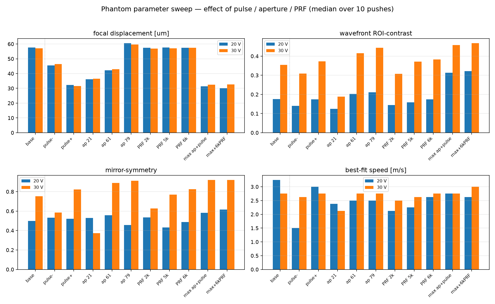
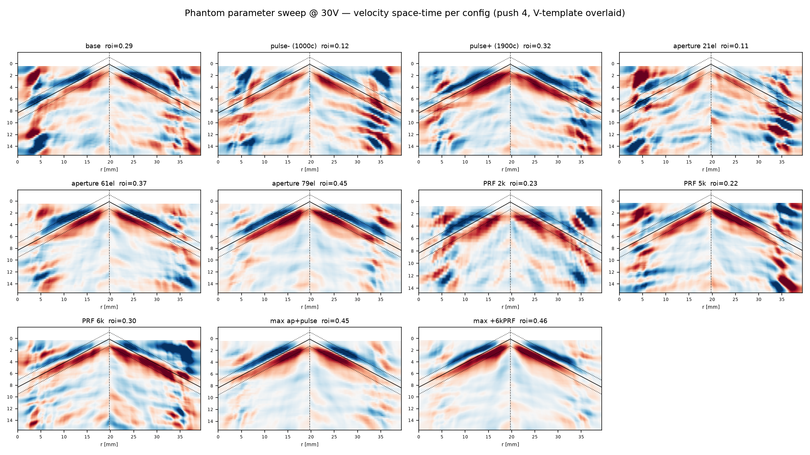

# Phantom acquisition parameter sweep — what improves the shear-wave space-time

**Date:** 2026-08-07 acquisition + analysis.
**Question:** which *acquisition* levers — push **pulse length**, push **aperture (F-number)**, and
**tracking PRF** — actually change the ARF shear-wave space-time, and what should we change for the
harder (in-vivo / low-SNR) case? This is the experimental follow-up to
`docs/caenen_vs_invivo_acquisition.md`, which argued the in-vivo gap is **push-strength-limited**.

## Data

`2026_08_04 voltage sweep/Phantom parameter sweep/` — one CIRS phantom, **11 configs × {20, 30} V**,
interleaved, **10 pushes per measurement** (instead of replicate acquisitions). One-at-a-time (OAT)
from a base config (1500 cyc / 41 el / 270 µs PRI = 3704 Hz), plus two interaction corners. Push
2.25 MHz, S5-1 (80 el, pitch 0.254 mm), focus 49.3 mm. **All 22 combinations verified present**
(voltage from TPC profile 5, pulse = `SW.pushCycle`, aperture = `SW.nb_push_elmts`, PRI = `SW.PRI_us`).

| lever | configs (cyc / el / PRI µs) |
|---|---|
| base | 1500 / 41 / 270 |
| pulse | **1000**, 1500, **1900** / 41 / 270  (≈ 448 / 670 / 851 µs) |
| aperture | 1500 / **21, 41, 61, 79** / 270  (F# 8.4 / 4.7 / 3.2 / 2.5 @ 49 mm) |
| PRF | 1500 / 41 / **500, 270, 200, 168** µs (2 / 3.7 / 5 / 6 kHz) |
| combos | 1900/79/270, 1900/79/168 |

**Pipeline fix required (documented so it isn't re-hit):** the acquisitions are raw RF; beamforming
needs a merged `CombinedData.mat`. Two issues were fixed: (1) `make_combined_data.m` **hardcoded
`SW.Nframes = 2`** for phantom → only 2 of 10 pushes came through; now it uses the runtime `Nframes`.
(2) The Receive/RcvBuffer *frame structure* differs per config (10 pushes; Ndetect varies with PRI:
30/16/40/48 for 270/500/200/168 µs), so a **per-config base config** is needed. `make_combined_data.m`
now auto-selects `PhantomSweep/BaseConfig_10frames_<cyc>cycles_<el>elements_<pri>PRI.mat` by the runtime
`(pushCycle, nb_push_elmts, PRI_us)`. **Base configs must be saved as v7.3 (HDF5)** — zea's reader is
h5py-only; v7 (“MATLAB 5.0”) files fail.

## Analysis (`scripts/sweep_params.py`)

Per push: **focal displacement** (peak |disp| at the ARF focus vs the pre-push reference, a push-strength
proxy) + wavefront **ROI-contrast** (locked 50 V V-template) + **mirror-symmetry** + **best-fit speed**.
Median over the 10 pushes; each lever compared to base at 20/30 V. **No MI data** → quality reported per
config, not per MI.




## Results — which levers move the space-time (ROI-contrast, 20 V / 30 V)

1. **Aperture (F-number) is the dominant lever — monotonic.** 21 → 41 → 61 → 79 el =
   **0.11 / 0.18 / 0.20 / 0.21** at 20 V and **0.19 / 0.35 / 0.42 / 0.44** at 30 V; symmetry
   0.37 → 0.75 → 0.89 → 0.91. In the montage `ap 21` is clutter-filled, `ap 79` is a crisp symmetric V.
2. **Voltage** — ~2× ROI (20 → 30 V) everywhere (expected).
3. **Pulse length — modest.** Longer slightly better (1900 c: 0.37 vs base 0.35 @ 30 V), short clearly
   worse (1000 c: 0.31). Smaller effect than aperture.
4. **PRF — small on a static phantom.** Higher PRF marginally better @ 30 V (6 kHz 0.38 vs base 0.35),
   low PRF (2 kHz) slightly worse (0.31). Expected — tracking isn't the bottleneck on a static target;
   PRF should matter more in vivo (moving wall).
5. **Combos are super-additive, and help most at low voltage.** Max aperture + long pulse (79/1900)
   gives the cleanest V (**ROI 0.46, symmetry 0.92 @ 30 V**) and **~doubles the 20 V base** (0.31 vs
   0.18). Adding 6 kHz PRF on top is marginal (+0.01). The gains come from **push strength
   (aperture ≫ pulse)** and compound where the base is weakest (low SNR).

**Speed** stays ~2.5–3 m/s across all configs (same phantom) — the levers change *clarity*, not the
measured stiffness (good sanity check).

**Focal-displacement caveat:** it came out *non-monotonic* — the strongest pushes (long pulse, combos)
gave the *lowest* focal displacement (~31 µm). That is a classic ARFI artifact: strong pushes
**decorrelate** the focal speckle, so Loupas *underestimates* the focal displacement even though the
propagating wave is clearest. So focal displacement is **not** a reliable push-strength proxy here — the
wavefront ROI/symmetry are, and they say aperture + pulse win.

## MI cost of a bigger aperture (Rayleigh-Sommerfeld coherent-sum estimate)

MI ∝ peak rarefactional pressure (fixed frequency) → MI ratio = focal-pressure ratio. At the actual
geometry, **essentially linear in element count** (small 0.37 λ elements, moderate F#, so nearly all
energy adds coherently at the focus; stable to ±0.5 % across attenuation / spreading assumptions):

| elements | F# | **MI vs 41 el** |
|---|---|---|
| 41 (base) | 4.7 | 1.00 |
| **61** | 3.2 | **≈ 1.48 (+48 %)** |
| **79** | 2.5 | **≈ 1.90 (+90 %)** |

**Pulse length does NOT change MI** (peak pressure unchanged; only thermal / I_spta rise) — the longer
pulse is "free" on MI. Caveats: linear-acoustics estimate (nonlinear saturation would make the real
increase somewhat *less*); relative only (no absolute MI here — watch the FDA 1.9 limit at 79 el); the
0.3 dB/cm/MHz derating and the fixed elevation lens cancel in the ratio.

## Recommendation

**Use 61 push elements + a ~800 µs (long) pulse.**
- **61 elements** captures nearly all the aperture benefit (ROI 0.42 vs 79 el's 0.44 @ 30 V) at
  **+48 % MI vs 79 el's +90 %** — 79 el buys only +0.02 ROI for almost double the MI penalty.
- **~800 µs pulse** adds a modest clarity gain at **no MI cost**.
- Their combination should be **super-additive at low voltage** (as the 79/1900 combo was), delivering
  the low-SNR robustness that matters for in-vivo — at a manageable +48 % MI.
- **PRF:** leave at the base (or raise modestly) — negligible on the phantom, but keep the option for
  in-vivo where the moving wall makes tracking rate matter (use a shallow wall-only high-PRF tracking
  window to avoid range-wrap; see `docs/caenen_vs_invivo_acquisition.md`).

Not directly tested: 61 el + long pulse *together* (the combo tested was 79 el). The OAT + combo
results support it, but it would be worth one confirmatory acquisition.

## Reproduce

```bash
# beamform each folder (auto-selects the per-config v7.3 base by pushCycle/elements/PRI)
SWP_BASE_CONFIG_DIR="…/Base config files" python run.py beamform "<folder>" --no-gifs
python scripts/sweep_params.py            # -> sweep_params.csv + sweep_params.png (+ montage)
```

## Caveats

- One phantom, meas over 10 pushes/config; voltage is a proxy for SNR. Absolute ROI numbers are
  phantom-specific; the *rankings* (aperture ≫ pulse ≫ PRF) are the transferable result.
- The MI estimate is first-order (linear acoustics); a nonlinear field simulation (Field II / k-Wave /
  KZK) would refine the absolute increase.
