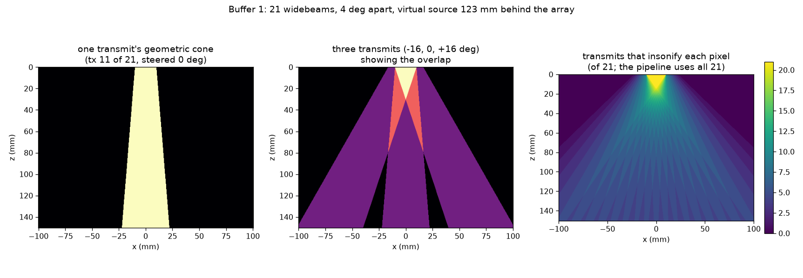
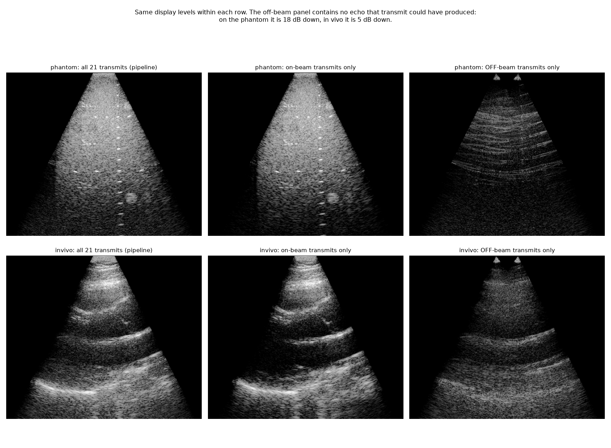
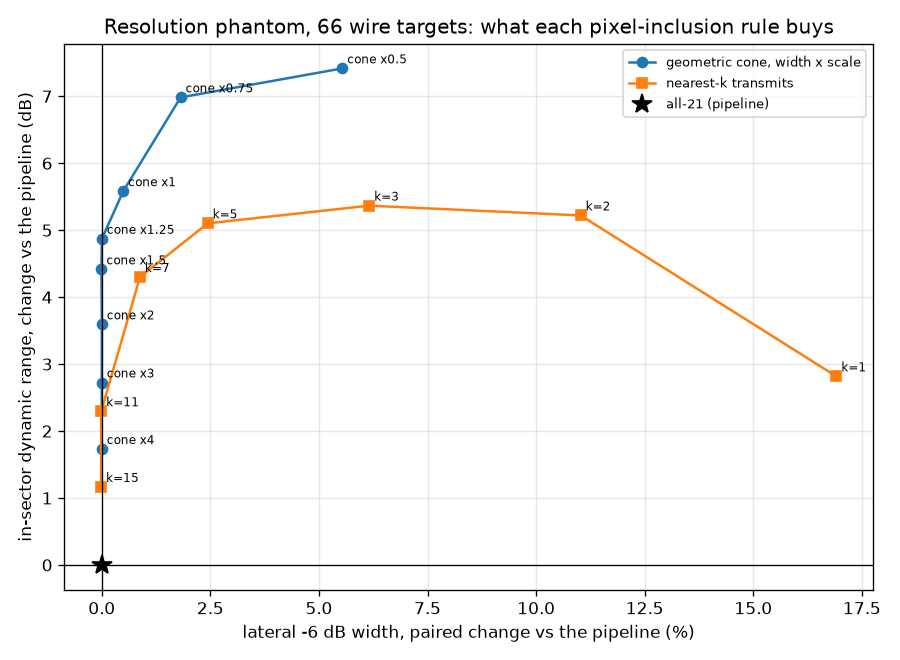
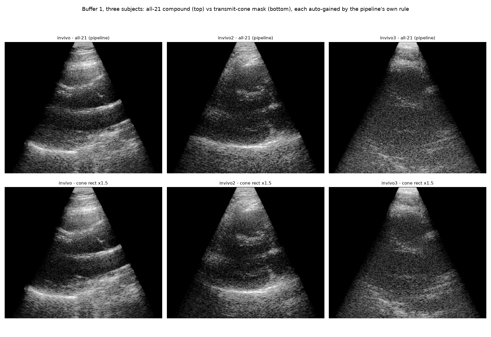
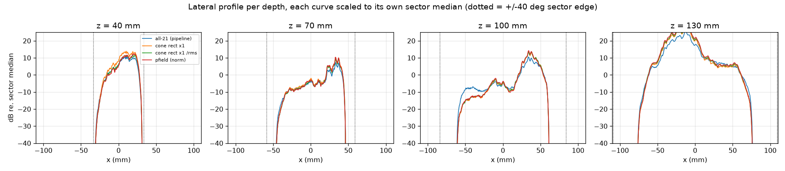
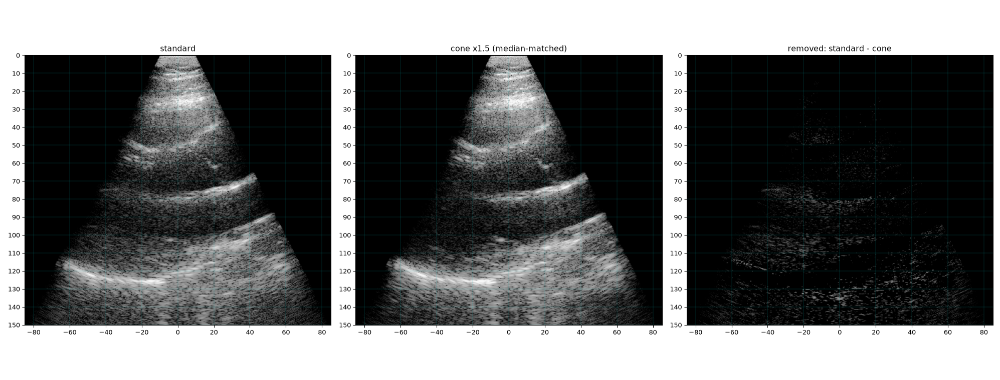
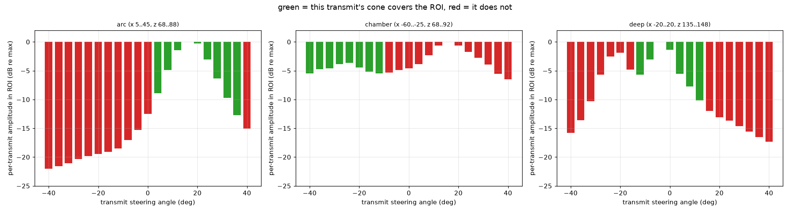
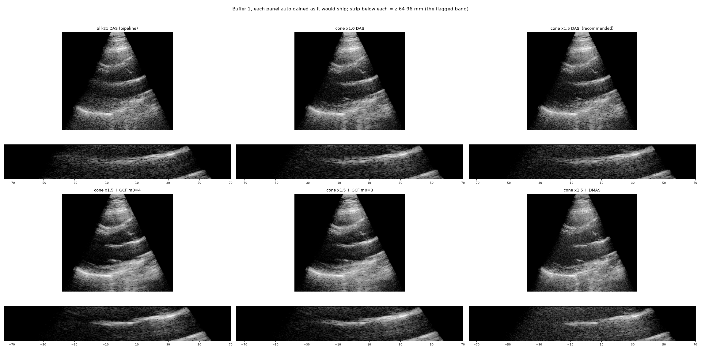

# Which pixels each transmit should reconstruct — the widebeam B-mode (buffer 1)

Investigation log for buffer 1, the widebeam orientation B-mode that the **passive M-lines are
drawn on**. Companion to [focused_bmode_striations.md](focused_bmode_striations.md), which asked
the same question of buffer 3 and got the opposite answer — for a reason this document makes
explicit.

**Result:** restricting each transmit to the pixels inside its own transmit cone raises dynamic
range by **+2.6 to +5.9 dB** on every subject and every frame tested, and dark-region contrast by
**+0.4 to +1.4 dB**, for **+12 %** beamforming time and a lateral −6 dB cost of +0.49 % at the
adopted width (and −0.01 %, CI [−0.16, +0.15], at ×1.5). It also removes real clutter, not only
noise — §12.

**Status: ADOPTED (2026-09-21)** for **both widebeam buffers, 1 and 5** —
`BufferSpec.tx_window = ("rect", 1.0)`, applied in `beamform_frames` via zea's
`AlignedApodization`. GCF was rejected on the cine as over-smooth. All 44 processed study
folders were re-run for both buffers; montage `study/montages/all_buffer1_txwin_best.gif`
(same 1360x876 geometry as the all-21 montages, so they overlay tile-for-tile), with the
all-21 montages kept beside it for reference.

**§12** goes after the clutter directly, prompted by something visible in the cine that none of
these metrics was looking for: it identifies where the clutter comes from (transmits aimed at the
opposite side of the sector), rejects receive-aperture tapering and f-number restriction with
numbers, and leaves GCF as an open visual question. It also revises the recommended cone width to
**×1.0** when clutter is the priority.

---

## 1. The sequence, as acquired

Read from the converted parameters of `Z:\raw_data\C000000001\SWE_01_SW_data_21-April-2026_12-12-54`
(identical on the resolution phantom and on C000000002 / C000000044):

| quantity | value | source |
|---|---|---|
| transmits | **21**, −40…+40°, pitch **4.000°** | `polar_angles` |
| transmit aperture | all **80 elements** = 20.07 mm, every transmit | `tx_apodizations` |
| apodization | raised cosine, edge weight **0.313** | `tx_apodizations` |
| focus | **−123.2 mm** — a virtual source *behind* the array | `focus_distances` |
| transmit origins | walk ±5.02 mm across the array | `transmit_origins` |
| grid | 382 × 509 px, 0.394 mm, x ±100 mm, z 0–150 mm | `PData` |

### How wide is one widebeam, really

The beam is the cone from the virtual source through the active aperture, so its half-opening is
an angle **about the virtual source**, not about the array:

```
geometric half-opening   4.66 deg (centre transmit) ... 5.80 deg (edge transmits)
```

That is a narrow cone, and because the source sits 123 mm behind the face, a pixel at 100 mm depth
is 223 mm from the source: the beam is only ±18 mm wide there, while the sector is ±84 mm wide.
Counting the cones that contain a pixel:

| depth | transmits that insonify it (of 21) |
|---|---|
| 20 mm | ~11 |
| 100 mm | **5** |
| 150 mm | ~5 |

> **A trap worth recording.** An "overlap" computed as `2 * phi_max / pitch` = 2×5.2/4.0 = 2.6×
> is **wrong**, and it was the first number this investigation produced. `phi_max` is an angle
> about the virtual source; the pitch is an angle about the array. At 100 mm depth the two differ
> by ~2.2×, so the real overlap is ~5, not 2.6. Count the cones; do not divide the angles.

**The pipeline compounds all 21 transmits into every pixel** (`zea` beamforms every pixel from
every transmit; `BufferSpec.pfield` and `BufferSpec.refocus` are both off for buffer 1). So
16 of the 21 contributions to a pixel at 100 mm come from beams whose cone does not contain it.



## 2. Method: a per-transmit stack, validated against the pipeline

Every transmit is beamformed **separately** onto the full PData grid and cached as a complex
stack `(n_tx, n_frames, nz, nx)`. Compounding is a linear sum over transmits, so any per-pixel /
per-transmit weight map can then be evaluated offline for free — 34 reconstructions in 16 s
instead of 34 beamforming runs.

The anchor: compositing the cached stack with **W = 1** reproduces the stored standard
reconstruction to `corr = 1.00000000`, mean relative difference 6e−8 (`b1_validate.py`). And the
production route — the same weight map handed to zea as
`Beamform(enable_aligned_apodization=True)` + `flat_aligned_apodization` — reproduces the offline
composite to the same precision (`b1_pipeline_check.py`). The study and the pipeline are the same
arithmetic.

Weight maps tested: geometric cone (rect / Hann / Tukey / Gaussian edges, width ×0.5…×4 of the
geometric half-opening), the −6 dB effective-aperture cone, fixed angular half-widths
(3–20°), nearest-*k* transmits (*k* = 1…15), zea's simulated transmit field (`compute_pfield`,
normalised and raw, and as a −6/−20 dB hard mask), each under three normalisations (none,
÷Σw, ÷√Σw²), plus transmit-domain coherence factor and incoherent compounding.

## 3. What the all-21 compound is actually adding

Split the 21 transmits per pixel into the ones whose cone **contains** it and the ones whose cone
**excludes** it, and reconstruct each set separately. The off-beam image contains no echo that
those transmits could have focused at that pixel. No ROI, no segmentation, no display choice
enters this measurement.

`20 log10(|off-beam| / |on-beam|)`, in-sector, cone ×1.0:

| depth band | resolution phantom | C000000001 |
|---|---|---|
| 10–40 mm | −25.5 dB | −21.4 dB |
| 40–70 mm | −21.5 dB | −9.0 dB |
| **70–100 mm** | **−18.0 dB** | **−4.9 dB** |
| 100–130 mm | −9.6 dB | −10.1 dB |
| 130–150 mm | +1.4 dB | −0.0 dB |

At 70–100 mm across all four datasets:

| dataset | off-beam / on-beam |
|---|---|
| resolution phantom | **−18.0 dB** |
| C000000001 | −4.9 dB |
| C000000002 | −0.4 dB |
| C000000044 | **+2.7 dB** |

**The phantom is the control, and it is what makes this decisive.** Its transmit geometry is
identical to in vivo — same 21 beams, same aperture, same virtual source — so whatever legitimate
beam-skirt energy lies outside the geometric cone is the same in both. It measures −18 dB. In vivo
the same quantity is 15–21 dB higher, and in C000000044 the off-beam transmits put *more* energy
at 70–100 mm than the on-beam ones. That 15–21 dB is not geometry. It is reverberation from the
chest wall and ribs, off-axis scattering and aberration — clutter, arriving through 16 beams that
were pointed somewhere else.



**Be precise about what this does *not* say.** The off-beam panel plainly contains anatomy: a real
beam has skirts beyond its geometric cone, so those transmits carry genuine, badly-focused echo as
well as clutter. The claim is not "it is all noise". It is that this energy is low-resolution and
preferentially lands in the echo-free regions — which §5 confirms by showing that removing it
darkens the dark end of the image while leaving point targets and their CNR untouched.

## 4. What every rule scores

34 rules × 2 datasets (`b1_eval.py`; full tables in `results_{phantom,invivo}_full.json`). The
excerpt below is the **resolution phantom**, frame-averaged: gCNR and contrast are the
hyperechoic inclusion at (24, 116) mm against matched background at the same depth, `lateral` is
the median −6 dB width over 66 wire targets. The in-vivo table uses hand-drawn chamber/tissue
ROIs and is in the JSON; its ranking is the same.

| rule | tx/pixel | dr (dB) | gCNR | contrast (dB) | lateral (median, mm) |
|---|---|---|---|---|---|
| **all-21 (pipeline)** | 21 | 63.7 | 0.446 | 8.23 | 1.74 |
| cone rect ×1 | 5 | 69.3 | 0.464 | 8.74 | 1.87 |
| cone rect ×1.5 | 8 | 68.2 | 0.454 | 8.54 | 1.80 |
| cone tukey50 ×1 | 4.3 | 71.1 | 0.480 | 8.91 | 1.85 |
| cone hann ×1 | 3.5 | 71.7 | 0.487 | 9.26 | 1.97 |
| nearest-1 | 1 | 66.6 | 0.543 | 9.71 | 2.09 |
| nearest-3 | 3 | 69.1 | 0.480 | 8.92 | 1.97 |
| fixed rect 20° | 16 | 65.5 | 0.438 | 8.26 | 1.73 |

> The `dr` column here is the **pre-correction** metric (|angle| ≤ 40° mask, p99.9/p1) — kept
> because the rules are ranked consistently by it, but §6 carries the corrected values and is the
> one to quote. The `lateral` column is the median-of-medians that §5 shows is too noisy to read.

Two things in that table are traps, and both were checked rather than believed:

* **gCNR rewards smoothed speckle.** `nearest-1` has the best gCNR on the phantom (0.543) and is
  visibly the worst image in vivo — it tiles the sector into transmit strips. Its speckle SNR is
  1.59 against 1.49 for the cone masks: the gCNR gain is reduced speckle variance, not better
  contrast. Only compare gCNR between rules whose speckle SNR matches. This is the same failure
  mode that made incoherent compounding look good for buffer 3 (S5a there).
* **The median lateral width is too noisy to read.** 1.74 → 1.87 mm looks like a 7 % resolution
  cost. It is not; see §5.

## 5. The resolution cost, measured paired per target — and the earlier reading it overturns

The 66 wires span 25–110 mm and 1.2–2.6 mm, and `find_targets` returns a slightly different set
per reconstruction. Comparing medians across sets buries a few-percent effect in that scatter.
Measuring the **same wire** in both reconstructions and taking the median of the per-target
**difference** removes it (`b1_round5.py`). Baseline: 66 measurable wires, median lateral 1.74 mm,
axial 0.94 mm.

| rule | Δ lateral | Δ axial | Δ wire CNR | Δ lat, <70 mm | Δ lat, ≥70 mm |
|---|---|---|---|---|---|
| cone rect ×0.75 | +1.8 % | +0.4 % | −0.14 dB | +1.7 % | +1.8 % |
| cone rect ×1 | +0.5 % | +0.1 % | +0.00 dB | +0.4 % | +1.2 % |
| **cone rect ×1.5** | **−0.0 %** | +0.0 % | +0.02 dB | −0.0 % | +0.0 % |
| cone rect ×2 | +0.0 % | +0.0 % | −0.00 dB | −0.0 % | +0.1 % |
| cone tukey50 ×1.5 | +0.3 % | +0.0 % | −0.01 dB | +0.2 % | +0.7 % |
| cone hann ×2 | +1.5 % | +0.2 % | −0.10 dB | +1.4 % | +1.7 % |
| cone ×1.5 × pfield | +2.9 % | +0.6 % | −0.15 dB | +3.0 % | +2.6 % |
| nearest-3 | +5.9 % | +1.8 % | −0.53 dB | +7.4 % | +5.5 % |
| nearest-5 | +2.1 % | +0.8 % | −0.16 dB | +3.7 % | +0.9 % |

With a bootstrap confidence interval on the median (4000 resamples of the 66 per-target
differences), so the claim is not resting on a point estimate:

| rule | median Δ lateral | 95 % CI | IQR |
|---|---|---|---|
| cone rect ×0.75 | +1.82 % | [+1.22, +2.58] | [+0.39, +5.26] |
| cone rect ×1 | +0.49 % | [+0.19, +1.26] | [−0.25, +3.06] |
| **cone rect ×1.5** | **−0.01 %** | **[−0.16, +0.15]** | [−0.58, +1.12] |
| cone rect ×2 | +0.00 % | [−0.05, +0.10] | [−0.25, +0.81] |
| cone tukey50 ×1.5 | +0.27 % | [+0.06, +0.70] | [−0.22, +2.39] |
| nearest-3 | +6.16 % | [+4.29, +9.73] | [+2.46, +15.61] |

**The geometric cone costs nothing.** At ×1.5 the change is indistinguishable from zero to
within ±0.16 %, while nearest-3 is unambiguously 4–10 % worse. The "+7 %" from the
median-of-medians in §4 was an artefact of comparing different target sets. Physically this is what should happen: a transmit that never
illuminated a wire contributes nothing to that wire's point-spread function, so discarding it
removes noise from elsewhere and leaves the PSF alone. It is exactly why buffer 3 behaved the
opposite way — there all 73 focused beams *do* overlap each pixel, so dropping them removes real
aperture and blurs (S5e there: nearest-1 = 2.05 mm vs 1.32 mm for all-73).

The whole trade, on one plot:



The cone family runs straight up the zero-cost axis from ×4 down to ×1.25 and only starts paying
resolution below ×1. The nearest-*k* family is **strictly dominated** — it pays resolution for less
dynamic range at every point. Rank-based selection is the wrong rule here: it ignores the geometry
and picks *k* transmits whether or not they reached the pixel.

## 6. Does it hold up? Three subjects, every frame

`b1_recheck.py`, anatomy-free metrics only, mean ± sd over all cached frames.

> **CORRECTION (first draft of this document).** The first version of this section used
> `sector_mask` (|angle| ≤ 40°, z > 5 mm) as the evaluation region. A large part of that mask is
> **exactly zero** — the reconstructed sector is narrower than ±40° at shallow depth, and at the
> rim the f-number mask removes every element. `dynamic_range_db` drops zeros before taking
> percentiles, so it never returned `inf` and the bug was invisible — but **a transmit window
> creates more zeros, and the ones it creates are the darkest pixels**, so the low percentile was
> taken over a different population for each reconstruction. That is a confound in the headline
> number, not a rounding detail.
>
> Everything below is recomputed on ONE fixed mask for every reconstruction: |angle| ≤ 32°,
> 20 ≤ z ≤ 145 mm, intersected with the pixels where *every* candidate is strictly positive
> (68 % of the old mask), reading the low end at the 5th percentile rather than the 1st.
> **The conclusion survives**: the gain is +2.6 to +5.9 dB instead of the +2.8 to +6.0 first
> reported. Absolute `dr` values shift (C000000001 baseline 67.0 → 58.0 dB) because the mask and
> percentile changed; the deltas do not. This is the fifth time in this family of investigations
> that a metric, not the data, gave the wrong answer.

* **dr** — dynamic range on the common mask, `20 log10(p99.9 / p5)`.
* **dark** — depth-normalised dark-region contrast: each depth row divided by its own median
  (removing TGC and the depth trend), then `20 log10(p50/p10)` on the same mask. How far below
  typical tissue the dark end of the image sits. Clutter filling echo-free regions pushes p10 up
  and this number down. No ROI, no segmentation.

| dataset (frames) | | all-21 | cone ×1 | cone ×1.5 | cone ×2 |
|---|---|---|---|---|---|
| C000000001 (16) | dr | 58.0 ± 2.1 | **+5.9** | +4.5 | +3.7 |
| | dark | 11.97 ± 0.18 | +1.17 | +1.23 | +1.32 |
| C000000002 (16) | dr | 52.5 ± 4.0 | **+5.3** | +3.7 | +2.8 |
| | dark | 10.41 ± 0.10 | +1.26 | +1.25 | +1.31 |
| C000000044 (16) | dr | 38.2 ± 0.9 | **+4.8** | +3.4 | +2.7 |
| | dark | 9.51 ± 0.08 | +0.36 | +0.39 | +0.51 |
| phantom (2) | dr | 60.4 ± 0.0 | **+4.5** | +3.3 | +2.6 |
| | dark | 12.03 ± 0.07 | +1.40 | +1.04 | +0.85 |

Same sign, same order of magnitude, every dataset and every frame — including C000000044, whose
acoustic window is the worst of the three (baseline dr 52.5 dB) and which gains the most visibly.



## 7. The field-of-view scare, and why it is a metric artefact

`sector_coverage` — the fraction of in-sector pixels above −50 dB of the clip's own 99.9th
percentile — falls from **63.8 % to 52.3 %** under the cone mask. That is the same metric, and the
same size of drop, that `BufferSpec.pfield` records as the reason pfield is off for buffer 1
("widebeam buffer 1 LOSES field of view, 56.6 → 50.2 %").

It is measuring the noise floor, not the field of view. A metric that counts pixels above a
threshold set by the bright end necessarily loses pixels when the dark end drops 6 dB, whether or
not any tissue went with them.

Measured directly instead — mean envelope vs *x* at 40 / 70 / 100 / 130 mm, each curve scaled to
its own sector median:



The curves lie on top of each other, including at the sector edges, at every depth. The only
separation is in the middle of the 100 mm panel, where the masked curves sit ~5 dB **lower** across
x = −60…−20 mm — the dark chamber, i.e. the clutter being removed. **No field of view is lost.**

The `pfield (norm)` curve in that figure is the one to note: it lies on the baseline at every
depth too, while its `sector_coverage` reads 54.0 % against the baseline's 63.8 %. So the
`BufferSpec.pfield` comment — "the widebeam buffer 1 LOSES field of view (56.6 → 50.2 %)" — is
resting on a metric that does not measure field of view. *Caveat:* the map used here is
`compute_pfield` called directly, not necessarily byte-identical to what `enable_pfield=True`
builds inside the pipeline, so this flags the recorded reason for re-checking rather than
refuting it outright. pfield weighting is still not the right tool for buffer 1 (§8), but on the
evidence here not because of field of view.

## 8. Tested and rejected

| approach | what happened | verdict |
|---|---|---|
| **nearest-*k* transmits** | strictly dominated by the cone at every operating point (§5) | rejected — the rule ignores whether the transmit reached the pixel |
| **÷Σw or ÷√Σw² normalisation** | equalises brightness where coverage is thin, but amplifies the noise there: gCNR 0.411 → 0.386/0.391, contrast 10.74 → 9.08/9.91 dB | rejected — the pipeline auto-gains per clip anyway, so there is nothing to equalise |
| **pfield weighting** (`compute_pfield`, normalised and raw) | raw pfield gives the best dynamic range of anything sane (75.4 dB) and the best contrast (11.28 dB), but costs **+2.9 %** lateral and needs a field simulation per geometry | rejected — the geometric cone gets the same gain for free, from data already stored |
| **pfield hard mask at −6 dB** | collapses to 1 transmit per pixel; dr 75.9 dB but the same tiling as nearest-1 | rejected |
| **transmit-domain coherence factor** | dr "111 dB", gCNR 0.400 → **0.242**, speckle SNR 1.08 → **0.52**; images are pitted and unnatural | rejected — destroys speckle statistics, the classic CF failure |
| **incoherent (envelope) compounding of the cone** | gCNR 0.542 and speckle SNR 2.00 look excellent; dr collapses 66.7 → 59.6 and the image is washed out | rejected — the same smoothing trap that flattered it for buffer 3 |
| **cone × pfield** | dr 75.3, contrast 11.28 — genuinely the best contrast numbers | **kept as a lead**, not a recommendation: +2.9 % lateral and speckle SNR 1.08 → 0.96 for ~1 dB over the plain cone |
| **receive band-pass** around the 2nd harmonic | `zea.ops.Demodulate` applies **no filter** — it takes the analytic signal and shifts by 3.906 MHz — so a surviving 1.953 MHz fundamental would beamform with the wrong phase rotation and land as defocused haze. Measured instead: the received band is 2–5 MHz peaking at ~3.5 MHz, and at 1.953 MHz it is already ~34 dB down, at the noise floor (`figures/rf_spectrum.png`) | **nothing to reject** — the Verasonics receive filter and probe response removed the fundamental before storage. A clean negative result; see §12 for the levers that do exist |

## 9. Cost

`Beamform(enable_aligned_apodization=True)` applies the mask to aligned data of shape
`(n_tx, n_pix, n_el)`, i.e. before the element sum, so it is one broadcast multiply over the
largest array in the pipeline. In-vivo buffer 1, 12 frames × 21 tx onto 382 × 509, both pipelines
warmed up, median of 3:

| | total | per frame |
|---|---|---|
| plain DAS (pipeline today) | 5.63 s | 469 ms |
| cone-masked DAS | 6.33 s | **527 ms (+12 %)** |

For scale: REFoCUS adjoint costs +6 % on buffer 3. Applying the weight *after* the element sum
would make it free, but that is a change inside zea's `Beamform`, not here.

## 10. Recommendation — adopted as ×1.0

**Decided on the cine (2026-09-21): buffer 1 is now `cone rect ×1.0`.** §12 is why the width came
down from ×1.5: clutter, not dynamic range, is what the widebeam B-mode was losing, and ×1.0 is
better on that axis. GCF, the one option left open, was rejected by eye as over-smooth.

The original ×1.5 reasoning is kept below as the record of how the number was first arrived at.

**Switch buffer 1 to `cone rect ×1.5`, after looking at the GIFs.** It is the knee of the measured
trade: +4.0 to +4.8 dB dynamic range and +0.5 to +1.2 dB dark contrast in vivo, at +0.0 % lateral
width, +12 % compute, on a buffer that exists for orientation and for drawing the passive M-lines.
`×1.0` buys about 1 dB more and costs +0.5 % lateral — also defensible; the difference between
them is smaller than the difference between subjects.

Two caveats before it becomes a default:

1. **It has not been judged on the task.** Everything above is image metrics plus stills. The
   thing that matters is whether the septum and the endocardial border are easier to follow when
   drawing a passive M-line, over a full cine, across the study — not on three frame-0 stills.
2. **Buffer 5 — resolved: it has exactly this transmit geometry and now gets the same
   treatment.** Scanned across all 44 study folders, every buffer-5 file is 21 transmits,
   −40…+40°, focus −123.2 mm, identical to buffer 1 (frame counts differ: 20/22/24, one per
   shear-wave measurement). Adopted 2026-09-21 and re-run over all 44. Note the cone is derived
   from each file's *own* stored geometry, so it stays correct even if a campaign changes the
   sequence — the scan confirms the assumption rather than being relied on.

   Buffer 6 (`Bmode_strain`) is described as a long widebeam and presumably shares it, but it is
   not converted in this study, so it is untested and left off. Buffer 4 (2 transmits, 12° apart)
   has no meaningful cone structure, and **buffers 2 and 4 must not be touched at all** — they
   feed the displacement estimators and any per-transmit reweighting changes their phase.
   `scripts/widebeam_bmode.py` refuses them.

```
python scripts/widebeam_bmode.py <folder> --buffer 1 --window rect --scale 1.5
```

writes `<stem>_buffer1_txwin-rect1.5_iq.hdf5` + GIF **beside** the normal output, so the two play
side by side (`scripts/gif_montage.py`). Nothing in the pipeline changes until
`BufferSpec` gains the field.

## 11. Reproducing

All of it runs from the cached per-transmit stacks; rebuilding a stack is ~35 s per dataset.
Scripts in `study/analysis/widebeam/`:

| script | what |
|---|---|
| `b1_lib.py` | per-transmit stack builder + virtual-source geometry |
| `b1_validate.py` | **run this first** — W=1 must reproduce the stored reconstruction |
| `b1_masks.py` / `b1_methods.py` | the weight-map library and the catalogue of rules |
| `b1_metrics.py` / `b1_rois.py` | metrics (gCNR, paired PSF, dark contrast) and the hand-drawn ROIs |
| `b1_eval.py` | the 34-rule sweep with montages (§4) |
| `b1_round2.py` | normalisation, pfield, and the lateral-profile FOV check (§7) |
| `b1_round3.py` | off-beam energy, coherence factor, incoherent (§3, §8) |
| `b1_round4.py` | three subjects × every frame, anatomy-free (§6) |
| `b1_round5.py` | paired per-target PSF and the runtime (§5, §9) |
| `b1_recheck.py` | the common-support mask and the corrected dr/dark (§6 correction) |
| `b1_round6.py` | clutter: receive aperture, f-number, CF^gamma, GCF, DMAS (§12) |
| `b1_round7.py` | where the chamber clutter comes from: per-transmit origin + the time-resolved correlation (§12) |
| `b1_pipeline_check.py` | the production route reproduces the study exactly |
| `b1_figures.py` | the four figures in this document |

`swp.acquisition.txwindow` is the production copy of the mask; it is verified against
`b1_masks.w_cone` to zero difference.

## 12. Clutter, specifically — where it comes from, and what else was tried

Reading the side-by-side cine rather than the tables turned up something none of the metrics
above was looking for. Across **z ≈ 68–88 mm** the standard reconstruction shows what reads as one
structure running continuously left to right; under the transmit cone it does not — the left half
of it is not anatomy. The aortic valve in the same band is also markedly clearer.

### What the cone removes, as an image



The right-hand panel is `standard − cone` (medians matched first, so it is not a gain difference).
It contains no crisp anatomy: haze filling the chamber at z 75–95 mm and a broad wash below
100 mm. That is the shape of clutter, not of signal.

### Which transmits put it there

The per-transmit stack answers this directly — for a given region, how much amplitude does each of
the 21 transmits deposit, and did its cone even cover that region?



* **The specular arc** (x 5…45 mm, a real structure) behaves as it should: the transmits aimed at
  it dominate, and the far-side transmits are 15–20 dB down.
* **The chamber beside it** (x −50…−25 mm, which should be echo-free) is the opposite. Its energy
  is nearly **flat across all 21 transmits**, and it *peaks* at +12 to +20° — transmits pointed at
  the arc on the **other side of the sector**, whose cone does not contain the chamber at all.
  They deposit about **4 dB more** there than the transmits actually aimed at the chamber.

So the false lateral structure is off-axis clutter radiated into the chamber by the transmits
illuminating the bright arc. That is a mechanism, not an inference from a metric, and it is
exactly what a per-transmit inclusion window can remove.

### Confirmed a second way: the clutter moves with the arc

The per-transmit diagnostic is a static argument. A time-resolved one is available for free, since
the 16 cached frames span a full cardiac cycle: if the chamber haze really is radiated from the
arc, it must rise and fall **with the arc** over the beat, while a reverberation artefact from the
chest wall would track the (near-stationary) near field instead.

Correlation across the 16 frames of the mean ROI envelope (n = 16, so |r| > 0.50 is p < 0.05):

| | vs arc brightness | vs near-field brightness |
|---|---|---|
| chamber, baseline (all-21) | **+0.82** | −0.51 |
| **the part the cone removes** | **+0.88** | −0.61 |
| chamber, what the cone keeps | −0.51 | **+0.74** |
| *control:* arc vs near-field | — | −0.55 |

The control matters: the arc and the near field are *anti*-correlated over the beat, so a global
frame-to-frame gain fluctuation cannot manufacture these signs.

**The cone flips what drives the chamber.** Before it, the chamber tracks the specular arc on the
opposite side of the sector (+0.82). After it, the arc dependence is gone (−0.51) and the residue
tracks the static near field (+0.74) — i.e. what remains is chest-wall reverberation, which no
transmit-aperture weighting can address. Two independent measurements, one static and one
time-resolved, agree on the mechanism.

### A metric for it

`arc` = `20 log10(arc peak / chamber floor)`: peak over z ∈ [68, 88] mm averaged across the arc
columns, over the 25th percentile of the chamber box (x −50…−25, z 72…92 mm, kept well inside the
sector). It is the number that moves when a false lateral extension disappears.

### Three further levers, on a rim-free mask

All measured on |angle| ≤ 25°, 25 ≤ z ≤ 130 mm, **verified to contain no zero pixels for any
candidate** — see the warning below, which cost this round a wrong answer before it gave a right
one. C000000001 frame 0.

| reconstruction | arc | dark | dr | gCNR | speckle SNR |
|---|---|---|---|---|---|
| all-21 DAS (pipeline) | 45.6 | 9.44 | 54.7 | 0.400 | 1.08 |
| **cone ×1.0 DAS** | **52.9** | 10.48 | **60.5** | 0.411 | 1.04 |
| **cone ×1.5 DAS** | 51.7 | **10.55** | 59.1 | 0.419 | 1.06 |
| receive Hann only | 48.1 | 9.32 | 54.9 | 0.417 | 1.11 |
| cone ×1.5 + receive Hann | 54.3 | 10.33 | 59.1 | **0.433** | 1.09 |
| cone ×1.5 + receive Tukey50 | 52.6 | 10.29 | 59.3 | 0.428 | 1.08 |
| cone ×1.5 + tx-CF^0.15 | 54.0 | 12.36 | 63.0 | 0.382 | 0.93 |
| cone ×1.5 + tx-CF^0.30 | 56.3 | 14.41 | 67.0 | 0.337 | 0.82 |
| cone ×1.5 + GCF m₀=4 | **66.9** | **13.52** | **74.1** | 0.397 | **0.72** |
| cone ×1.5 + GCF m₀=8 | 62.7 | 12.83 | 69.0 | 0.395 | 0.81 |
| cone ×1.5 + DMAS | 63.1 | 11.93 | 68.8 | 0.368 | 0.85 |

> **The same metric-mask bug, caught twice.** The first run of this table used the |angle| ≤ 40°
> mask and reported receive Hann at **dark +4.4 dB, dr +13.4 dB** — a bigger effect than the
> transmit cone itself. It was entirely an artefact: the Hann taper zeroes the outermost elements,
> and at the sector rim, where the f-number mask has already removed most of the aperture, that
> leaves near-null pixels. `p1` fell from 26 to 0.5. On a rim-free mask the same comparison is
> `dark` 10.55 → 10.33 (slightly **worse**) and `dr` unchanged. Audit the zero fraction inside the
> evaluation mask before reading any percentile-based metric. The f-number rows failed the same
> audit outright: **f/2 zeroes 38 % of the mask and f/3 zeroes 52 %** — they do not suppress
> clutter, they delete the sector, which the band zoom shows directly.

### Receive aperture: rejected, with the number that settles it

Tapering the receive aperture is the receive-side twin of the transmit cone, and it is not free
the way the transmit cone is. Paired over the 66 wire targets:

| | Δ lateral −6 dB | 95 % CI | Δ axial |
|---|---|---|---|
| cone ×1.5 DAS | −0.01 % | [−0.16, +0.17] | +0.04 % |
| cone ×1.5 + receive Hann | **+12.44 %** | [+9.58, +22.74] | +3.41 % |
| cone ×1.5 + receive Tukey50 | +8.56 % | [+5.64, +13.48] | +1.19 % |

**+12.4 % lateral for +2.5 dB of arc contrast is a bad trade** on a buffer whose job is tracing
the septum and the endocardial border. And it is the general rule this whole investigation keeps
running into: *the transmit cone is free because the transmits it discards carry no focused signal
for that pixel.* Every other lever — receive taper, f-number, nearest-k, pfield, coherence
weighting — removes or distorts data that **does** carry signal, and is charged accordingly.

### The one option still open: GCF

`generalized_coherence_factor` (m₀ = 4) is the only thing tested that beats the cone on the
targeted metric by a wide margin (arc 51.7 → 66.9 dB) **and** is better on phantom point targets:

| | Δ lateral | 95 % CI | Δ axial | Δ wire CNR |
|---|---|---|---|---|
| cone ×1.5 + GCF m₀=4 | −0.87 % | [−1.62, +0.49] | −3.99 % | **+2.56 dB** |
| cone ×1.5 + GCF m₀=8 | +0.36 % | [−0.34, +1.12] | −0.95 % | +1.06 dB |
| cone ×1.5 + DMAS | **−28.40 %** | [−30.84, −22.45] | −17.77 % | **+9.88 dB** |

It costs ~10 s per 16 frames — no more than plain DAS.

**But do not adopt it on those numbers.** In vivo its speckle SNR falls 1.06 → **0.72** and its
gCNR does not improve (0.419 → 0.397): it is buying contrast by changing the speckle statistics,
which is the same signature that made incoherent compounding and full-strength CF look good and
be wrong. DMAS is the extreme case — a spectacular −28 % on wires and the **worst** in-vivo gCNR
of anything tested (0.368). This is precisely the failure the striations investigation warned
about: *"any future phantom-only verdict should be distrusted"* for nonlinear beamformers, because
a phantom of isolated wires rewards contrast enhancement that is meaningless in speckle.

So GCF is a **different look**, not a strict improvement, and whether it helps is a question about
tracing borders on a cine — which is a judgement for the eye, not for this table. It is therefore
reachable from the shipped script but never the default:

```
python scripts/widebeam_bmode.py <folder> --buffer 1 --scale 1.0        --beamformer generalized_coherence_factor --m-zero 4
```

writes `<stem>_buffer1_txwin-rect1-gcf4_iq.hdf5` + GIF alongside the others. Note it is
memory-hungry over a full 90-frame buffer (~12 GB resident, ~9 min end to end including the read
from `Z:`), against ~1 min for plain DAS — the 10 s/16 frames figure above is GPU time only.



### Revised recommendation

**`cone rect ×1.0`** if clutter is the priority, which the flagged band says it is: it beats ×1.5
on the targeted metric (52.9 vs 51.7 dB) and on dynamic range (+4.5 to +5.9 dB vs +3.3 to +4.5
across the four datasets), for a lateral cost of **+0.49 %**, CI [+0.19, +1.26] — real, but an
order of magnitude below the ~5 % that separates the rejected options.

**`cone rect ×1.5`** remains the choice if a provably zero resolution change matters more than the
last decibel. `DEFAULT_SCALE` in `swp.acquisition.txwindow` is 1.5 for that reason; `--scale 1.0`
switches it.

Everything else tested here is either rejected on measurement (receive taper, f-number,
transmit-domain CF) or an open visual question (GCF).
